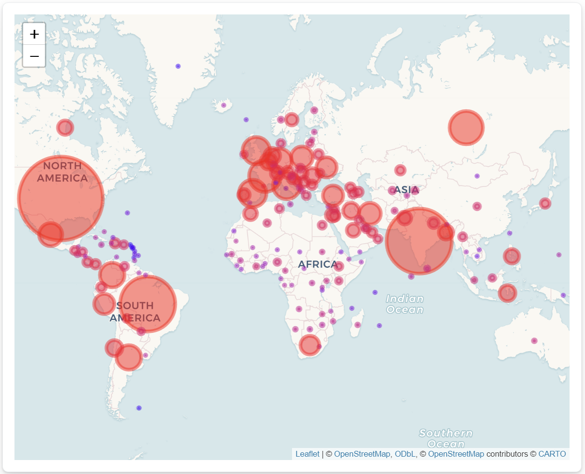
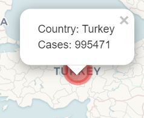

```{r}
#| label: setup
#| include: false

# set code chunk option defaults
knitr::opts_chunk$set(
  warning = FALSE,
  # display code as types
  tidy = FALSE, 
  # slightly smaller code font
  size = "small",
  # do not display messages in PDF
  message = FALSE,
  # set default figure width and height
  fig.width = 5, fig.height = 3)


# improve digit and NA display 
options(scipen = 1, knitr.kable.NA = '')

# load packages
library(tidyverse)
library(lubridate)
library(ical)
library(kableExtra)
library(janitor)
library(dplyr)
library(stringr)
library(topicmodels)
library(tm)
library(tidytext)
library(textdata)
library(reshape2)
library(formatR)
```

# Introduction

We all remember COVID-19 as the days we remained closeted up alone in our rooms with nothing to do but doomscroll through countless Youtube and Tiktok videos. Under such circumstances, we were consuming content at immaculate rates, but how many times was it that you stumbled across a piece of media that seemed dubious? Although it may have seemed dubious to us, it turns out that "over 78% of the public believes or is unsure about" at least one piece of COVID-19 misinformation (KFF, 2021). Moreover, the situation was only worse in developing countries with poorer educational structures, which made misinformation about COVID only that much more potent. Having come from a developing country myself (Pakistan), I was well aware of the crises at hand there: people using non-scientific ailments, conspiracies against governments of other countries and not following the protocols of quarantine.

For my Final Project, I intended on looking at COVID-19 spread and misinformation (in 2020). In particular, the highlight of my project was performing a topic analysis on the titles of mininformation articles that had been compiled into a dataset, i.e looking at what general 'topics' could be extracted from them. Not only did I perform a topic analysis of misinformation across the globe, but the more important idea was looking at how what misinformation topics were spread across certain countries too. I wanted to see if there was any association between the cultures, geographies, number of COVID cases and development of the country with the topics of misinformation that were being spread across those regions. To aid my analysis with respect to the spread of COVID cases, I also developed a spatial visualization of the cases on a world map.

# Data

This project entailed having two primary datasets. The specific wrangling code for both can be found in "Data Wrangling - Final Project .Rmd". The links to both the primary datasets may be found in the references.\

The first, by the European Center for Disease Prevention and Control, included the number of daily cases per country in 2020. This was collected during the COVID-19 epidemic in order to help note the testing efficacy of countries around the world and improve it. For my specific case, I needed this dataset in order to display a visualisation of the COVID spread in 2020 using a map. So we had to condense the daily cases per country into a number for the yearly cases per country. The top 5 rows of the intermediate dataset looked like this:

```{r echo = TRUE, tidy = TRUE}

#Importing dataset of covid cases
casesCountryData <- read_csv("COVID Datasets/dailyCases.csv")
casesCountryDataSelected <- casesCountryData %>%
  select(cases, deaths, countriesAndTerritories)
  
#Since the cases dataset is of daily cases per country in the year 2020
#we are going to have to summarise the data and group by country

casesCountryDataSummarized <- casesCountryDataSelected %>%
  group_by(countriesAndTerritories) %>%
  summarise(
    Cases = sum(cases)
  )

top_5 <- head(casesCountryDataSummarized, n = 5)

kable(top_5)

```

Furthermore, I had to manually change some names of countries (which were inconsistently named and had underscores) so that I could merge it with a dataset of latitudes and longitudes. Merging it gave it spatial coordinates, which allowed it to be used to plot in leaflet. The first wrangled dataset is shown below.

```{r echo = FALSE}

#Importing corrected Names dataset
CorrectedNames <- read_csv("COVID Datasets/CountryDataSummarizedCorrectedNames.csv")

#Importing dataset of latitudes and longitudes of each country, and getting rid of country codes
latitudelongitudeData <- read_csv("COVID Datasets/latlong.csv") %>%
  select(Country, Latitude, Longitude)

#Merging the datasets into one so we have a country with its designated latitude and longitude alongside their cases
casesCountryLatLong <- left_join(CorrectedNames, latitudelongitudeData, by = c("Countries" = "Country"))

kable(head(casesCountryLatLong, 5))

```

With the cases dataset ready, it was time to move onto the misinformation dataset. This data was provided by UNESCO and compiled by the Empirical Studies of Conflict (Princeton University), so it can be considered a trustworthy source. It was collected from the early days of he pandemic through the end of 2020 as well with over 5,600 misinformation stories. Although trustworthy, we must note that what is deemed as "misinformation", ultimately fell into the hands of the organization at Princeton that compiled the data, so it should be acknowledged there is an aspect of subjectivity as to what inherently is misinformation, with some topics being slightly more vague than others.

There was some wrangling required for this part to simply filter out any words that were non-english (as the topic analysis we were performing may only be performed on English words). This does create a marginal issue with our analysis where we may not be able to fully get a grasp over the misinformation on a country as we are just limiting our analysis to English topics. However, for our purposes, it is a very minimal effect. Below is a sample of what the Title of an Article looks like and which country it is from.

```{r echo = FALSE}

LDAAnalysisDataset <- readRDS("Saved RDS Files/LDATopicAnalysisData.rds")

sample <- LDAAnalysisDataset %>%
  select(Title, Primary_Country)

kable(head(sample, 1))

```

This now meant that we were ready to begin our journey on visualizing and investigating the spread of COVID and its misinformation throughout the world.

# Methods

**Shiny Map Visualization**

In a similar vein to my data structuring and wrangling, my methods were divided into two parts. The first was the visualization of COVID spread using a Shiny Application, and the second was misinformation topic analysis using Latent Dirichlet Allocation.

The first method was the Shiny Application. The goal was to create a map using Leaflet that would show the general outbreak on a larger scale. The initial idea was to make a a map that was colorized on the basis of the outbreak; however, implementing that in Shiny proved to be too difficult an implementation. Rather, markers were used to aid the visualization.

The map has circular markers on it that represent the number of COVID cases in a given country. Those markers were meant to be colorized according to the number of cases as well, with blue representing a fewer number of cases and red representing a large number of cases. Furthermore, the map was built to make the markers clickable; they display the country name and the number of cases in that country. There is also a drop down on the sidebar of the shiny app, where the user may select a country they want to see the cases for and a view box that displays the number of COVID cases in that country.

Below are images of what the general world map looks like *(Figure 1)* and the interactability of the shiny map *(Figure 2).* The implementation of Leaflet and its interactibility was also a part of my "Go Beyond" aspect, where I hadn't implemented spatial visualizations using leaflet in class before.





**LDA Topic Analysis**

The core part of the project lies here, in the LDA Topic Analysis. The way LDA topic analysis works is by tokenizing words and using a mathemtical network analysis (Grün and Hornik, 2011) extract topics of terms which go together within it. \
\
To execute this, we first had to tokenize our wrangled dataset, by unnesting tokens from the tidytext package. This allows for us to break up the titles into individual words for each title. Next, we had to edit this set of unnested words by removing the stop words and also removing words like "covid", "19" and "coronavirus". This is because we don't want words that don't convey any information relevant to misinformation. The stop words have a similar situation, where they are common words and don't add much value to the topic analysis.

However, there was one more step to the pre-processing required for the Topic Analysis. This was to convert the data frame into a document-term matrix (DTM). A DTM represents the frequency of words in a mathematical matrix. DTM's are generally quintessential to any form of language processing, and especially useful in our case where to perform the LDA analysis using the topicmodels package we had to convert it to a DTM format (Grün and Hornik, 2011).

```{r echo = TRUE}

#Loading our wrangled dataset from Saved RDS Files

LDAAnalysisDataset <- readRDS("Saved RDS Files/LDATopicAnalysisData.rds") 

#Tokenizing the text

tokenizedLDADataset <- LDAAnalysisDataset %>%
  unnest_tokens(output = word, input = Title) %>%
  select(Primary_Country, word)

# Filter out words like "COVID" and "19" and "coronavirus"
filterWords <- c("covid", "19", "coronavirus")

tokenizedLDADataset_filtered <- tokenizedLDADataset %>%
  filter(!word %in% filterWords) %>%
  select(Primary_Country, word)

#Getting rid of the stop words

data(stop_words)

tokenizedLDADataset_stopped <- tokenizedLDADataset_filtered %>%
  anti_join(stop_words, by = "word")

#Now we're trying to convert tokenized data to a Document-Term Matrix

dtm <- tokenizedLDADataset_stopped %>%
  count(Primary_Country, word) %>%
  cast_dtm(Primary_Country, word, n)
```

Finally, we can run the LDA text analysis using the topicmodels package as shown in the code chunk below. Notice how we run it twice. This is because the LDA function takes the number of topics as its second parameter. In my LDA Analysis file, I ran the code chunk multiple times to experiment with multiple different topics. I will discuss in my results further how I decided the number of topics to decide for my LDA analyses, which is primarily based off coherence of the terms with each other.

```{r echo = TRUE, eval = TRUE}


analysisLDA <- LDA(dtm, 3, method = "Gibbs", control = list(seed = 123))

topics <- tidy(analysisLDA, matrix = "beta")

topics %>%
  group_by(topic) %>%
  top_n(5, beta) %>%
  ungroup() %>%
  mutate(term = reorder(term, beta)) %>%
  ggplot(aes(term, beta, fill = factor(topic))) +
  geom_col(show.legend = FALSE) +
  facet_wrap(~ topic, scales = "free") +
  coord_flip()

analysisLDA <- LDA(dtm, 6, method = "Gibbs", control = list(seed = 123))

topics <- tidy(analysisLDA, matrix = "beta")

topics %>%
  group_by(topic) %>%
  top_n(5, beta) %>%
  ungroup() %>%
  mutate(term = reorder(term, beta)) %>%
  ggplot(aes(term, beta, fill = factor(topic))) +
  geom_col(show.legend = FALSE) +
  facet_wrap(~ topic, scales = "free") +
  coord_flip()


```

In this, the topics are labelled as "1", "2"..., and they will be named later in the results and findings page. For each topic, terms are given based on what the model thinks the coherence is for each of these.

Next, I wanted to perform LDA Analyses on individual countries. Since I had already wrangled my dataset to include the countries from which each term was from, this was done by simply filtering the data with respect to each country I wanted to analyse. In particular, I looked at countries with a high number of COVID cases, which is why I explored Pakistan, India and the United States.

My first analysis was filtering the misinformation topics that were in Pakistan. I repeated the same process of exploring various topics between 2 and 8 like I did above. However, those visualizations are omitted for redundancy.

```{r echo = FALSE}

PakistanLDAdataset <- tokenizedLDADataset_stopped %>%
  filter(Primary_Country == "Pakistan")

dtmPAKISTAN <- PakistanLDAdataset %>%
  count(Primary_Country, word) %>%
  cast_dtm(Primary_Country, word, n)

#Specifying the number of topics we want for our country analysis

analysisLDAPakistan <- LDA(dtmPAKISTAN, 6, method = "Gibbs", control = list(seed = 123))

topicsPakistan <- tidy(analysisLDAPakistan, matrix = "beta")

topicsPakistan %>%
  group_by(topic) %>%
  top_n(2, beta) %>%
  ungroup() %>%
  mutate(term = reorder(term, beta)) %>%
  ggplot(aes(term, beta, fill = factor(topic))) +
  geom_col(show.legend = FALSE) +
  facet_wrap(~ topic, scales = "free") +
  coord_flip()

```

A similar process was followed for the United States:

```{r echo = FALSE}

USLDAdataset <- tokenizedLDADataset_stopped %>%
  filter(Primary_Country == "US")

dtmUS <- USLDAdataset %>%
  count(Primary_Country, word) %>%
  cast_dtm(Primary_Country, word, n)

#Specifying the number of topics we want for our country analysis

analysisLDAUS <- LDA(dtmUS, 6, method = "Gibbs", control = list(seed = 123))

topicsUS <- tidy(analysisLDAUS, matrix = "beta")

topicsUS %>%
  group_by(topic) %>%
  top_n(2, beta) %>%
  ungroup() %>%
  mutate(term = reorder(term, beta)) %>%
  ggplot(aes(term, beta, fill = factor(topic))) +
  geom_col(show.legend = FALSE) +
  facet_wrap(~ topic, scales = "free") +
  coord_flip()


```

Finally, I did this process for India:

```{r echo = FALSE}

indiaLDAdataset <- tokenizedLDADataset_stopped %>%
  filter(Primary_Country == "India")

dtmINDIA <- indiaLDAdataset %>%
  count(Primary_Country, word) %>%
  cast_dtm(Primary_Country, word, n)

#Specifying the number of topics we want for our country analysis

analysisLDAINDIA <- LDA(dtmINDIA, 4, method = "Gibbs", control = list(seed = 231))

topicsINDIA <- tidy(analysisLDAINDIA, matrix = "beta")

topicsINDIA %>%
  group_by(topic) %>%
  top_n(5, beta) %>%
  ungroup() %>%
  mutate(term = reorder(term, beta)) %>%
  ggplot(aes(term, beta, fill = factor(topic))) +
  geom_col(show.legend = FALSE) +
  facet_wrap(~ topic, scales = "free") +
  coord_flip()


```

This summarizes the methods I had taken to perform my LDA Topic Analyses. To reiterate, each model for the countries that were investigated made sure that their topics were experimented with so that they are cohesive. Furthermore, as we will discuss in our results and findings, there are some topics that don't fit well with each other.

# Results and Findings
